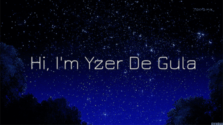

  

<h2 align="center">
  Technology Stack
</h2>

  
  
  
  
  
  
  

<h2 align="center">
  My Github Stats
</h2>

|  |  |
| ------------- | ------------- |

 

 

<h2 align="center">
  Top Repositories
</h2>

|  |  |
| ------------- | ------------- |
